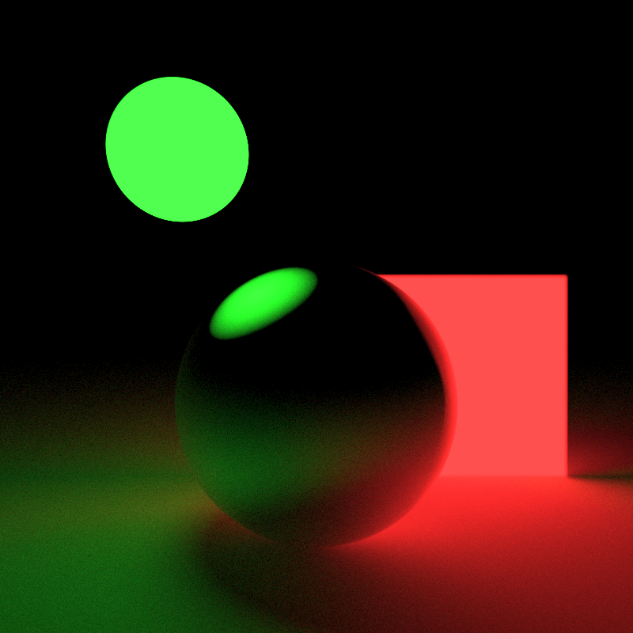
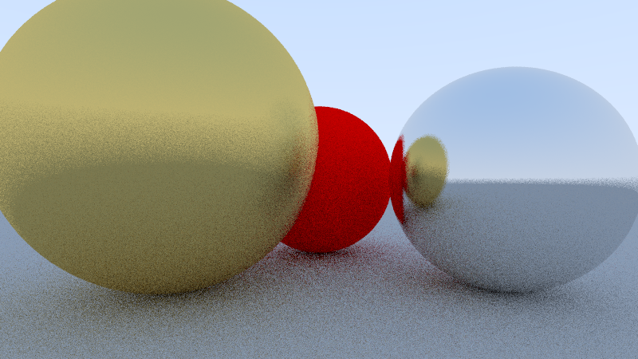
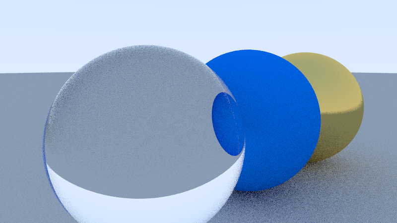
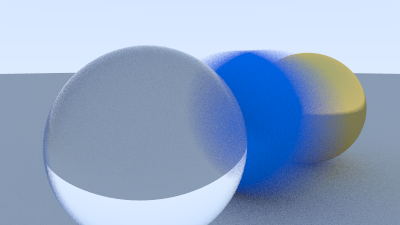
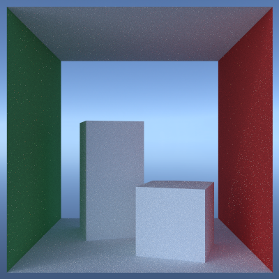
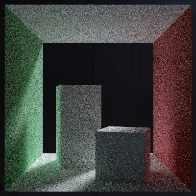
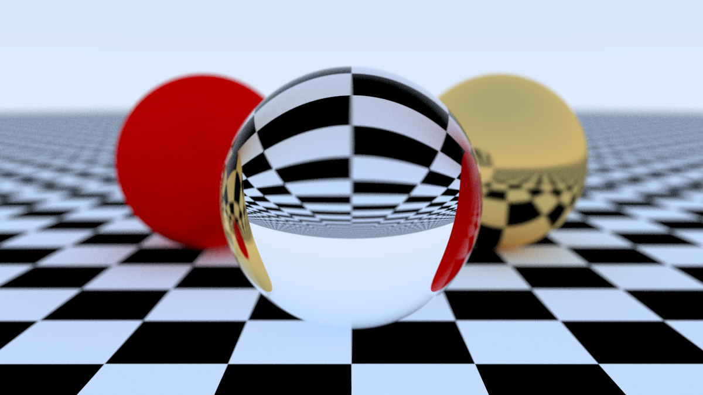
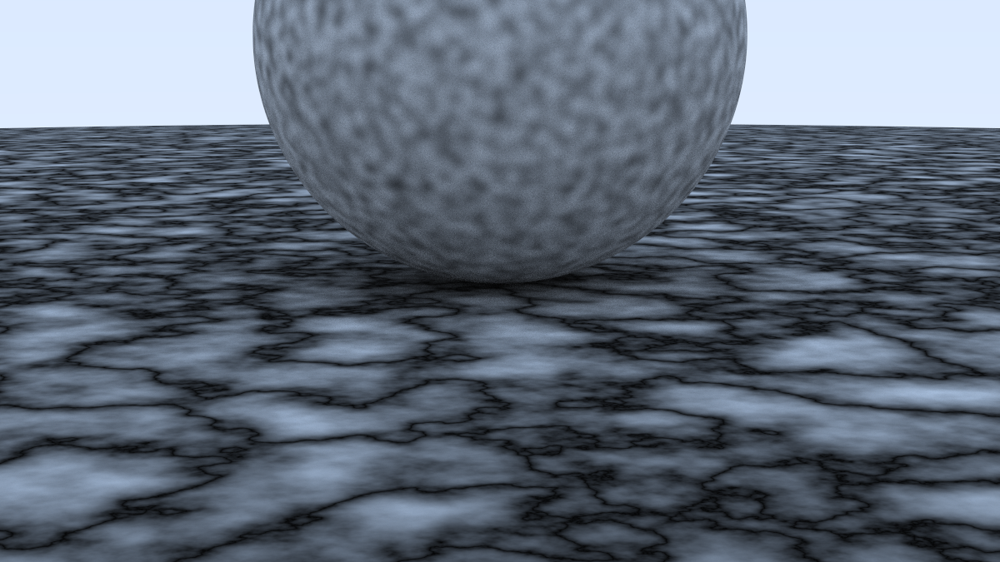
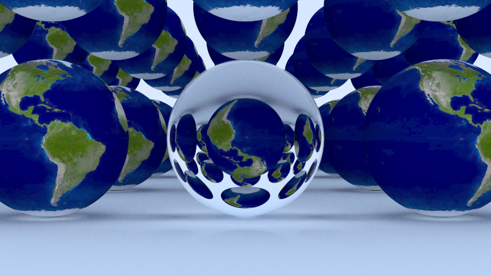
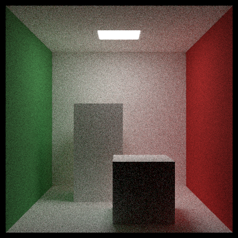

> [!Warning]
> Hic Sunt Dracones
>
> This project is in its infancy and this repository is far from being useful.

# raytracer

A path tracer hobby project. Part of this project follows the book series *[Raytracing in One Weekend](https://raytracing.github.io)*.

## Examples
These are some examples of the current capabilities of this path tracer. Click on the images for full-size previews.

### Materials
Currently, the program supports diffuse and lambertian objects, as well as different metals and simple dielectrics like glass.

 
 

### Camera Simulation
Different effects like depth of field and linear motion blur can be simulated.

 
 

### Environment Maps
HDRIs or environment maps can be used for scenes without light-emmitting objects. (The below images were produced with the same amount of samples, notice the noise difference between the brighter and darker environments.)

 
 

### Textures
The raytracer currently supports some procedural textures (e.g. checker pattern and perlin noise) and image textures.

 
 
 

### Obligatory Cornell Box
To ensure the recognition by computer graphics researchers. Notice the immense amount of noise.

## License Notice
The texture at `/resources/earth.png` is licensed under CC BY-SA 3.0. Image by NASA Goddard Space Flight Center (Reto Stöckli, Robert Simmon). Data: MODIS Groups, USGS, DMSP.
